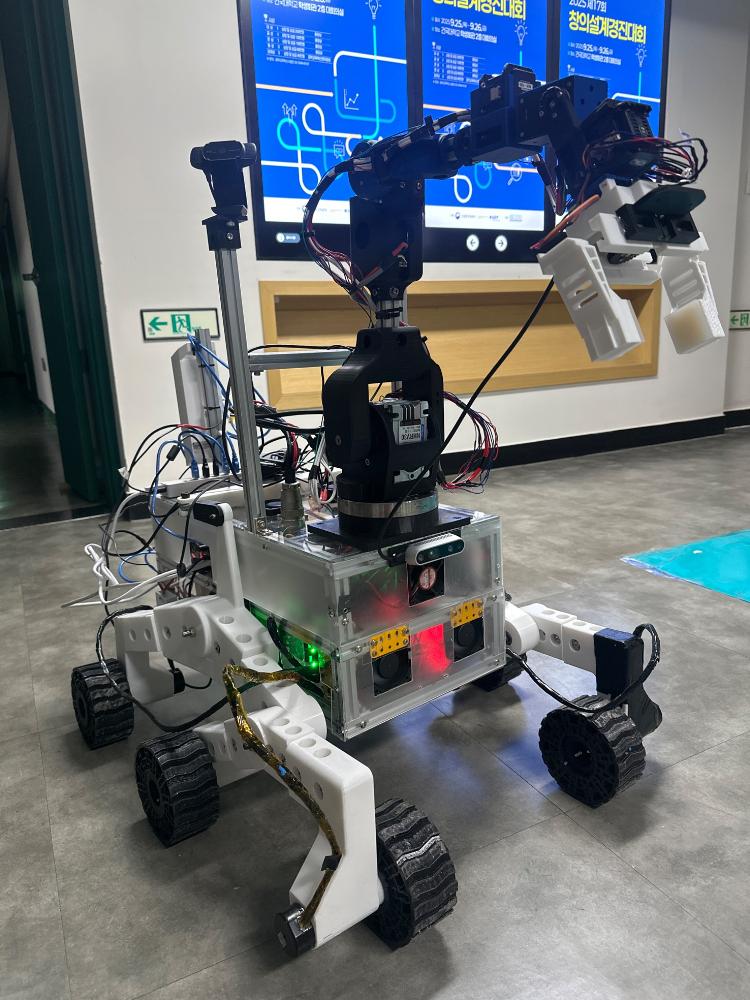
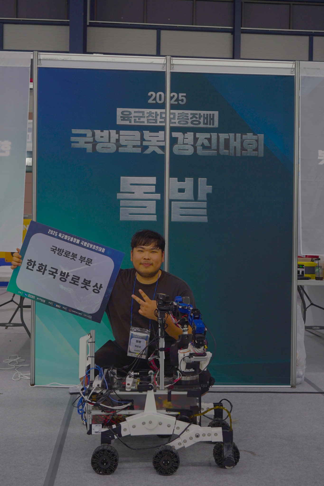
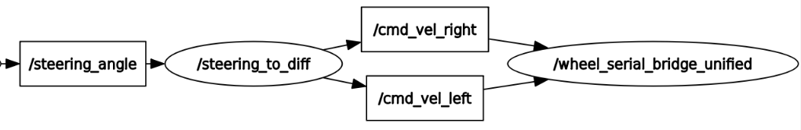
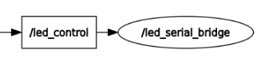

# DolbotX-6WD ROS2 Real Robot Control Stack
**Closed-loop PID Drive (Arduino Mega) + Robust Serial Bridges + Target Following**

---

## 0. What this repository is

This repository is the **real-robot control layer** of a 6WD differential-drive robot used in competition environments.

It bridges:
- ROS2 high-level outputs (steering angle / target position / state)
→ **wheel velocity setpoints**
→ **serial streaming**
→ Arduino Mega running a **closed-loop PID wheel speed controller** (encoder feedback)
→ 6 motors (3 left, 3 right)

It also includes:
- LED state feedback via a dedicated Arduino LED controller
- An object follower (3D target → wheel velocities)
- A steering-to-differential converter (Ackermann-style steering angle → wheel speeds)
- A robust wheel serial bridge with auto-reconnect and safety timeouts

---

## 1. Media

### 1.1 Robot Platform

<p align="center">
  
</p>

**DolbotX** is a 6WD differential-drive unmanned ground vehicle (UGV) designed for  
rough-terrain mobility, modular deployment, and real-world robotic missions.

Key features:

- 6WD rocker-bogie inspired terrain driving structure  
- Obstacle traversal capability up to ~0.25 m  
- Modular 3D-printed mechanical design  
- ROS2-based real robot control architecture  
- Encoder-based closed-loop PID wheel velocity control  
- Dual-arm manipulator integration  
- Vision-based target detection and following  
- LED-based robot state feedback system  

The platform was developed with a **low-cost, field-repairable tactical robot concept**,  
allowing rapid component replacement and repeated deployment in real environments.

Closed-loop encoder-based PID control ensures stable velocity tracking under:

- rough terrain  
- slope changes  
- battery voltage variation  
- asymmetric wheel load  

This project demonstrates a full-stack real robot system integrating  
mechanical design, embedded control, and ROS2-based autonomy.

---

### 1.2 Competition & Award

<p align="center">
  
</p>

<p align="center">
  <b>Awarded 2nd Place – Hanwha Defense Robotics Award</b><br>
  Korea Intelligent Robot Competition, Defense Robotics Division
</p>

This robot was developed for and demonstrated at the  
**Korea Intelligent Robot Competition – Defense Robot Division**,  
organized by the Korea Institute of Robotics & Technology Convergence (KIRO).

Competition details:

- Organizer: Korea Institute of Robotics & Technology Convergence (KIRO)  
- Event: Korea Intelligent Robot Competition  
- Division: Defense Robotics  
- Focus:
  - real robot mobility in rough environments  
  - autonomous navigation capability  
  - mission-based robotic operation  
  - field deployment scenarios  

The defense robotics division evaluates robot systems in  
practical mission-like environments including terrain traversal,  
autonomous driving, and real-world deployment capability.

Our team successfully demonstrated:

- rough-terrain robot driving  
- ROS2-based control integration  
- modular robotic architecture  
- real hardware deployment  

This project represents an end-to-end implementation from  
hardware platform to embedded control and ROS-based autonomy.

---

### 1.3 Real Driving Videos

## ▶ Main Field Demonstration

<p align="center">
  
</p>

<p align="center">
  <b>Full System Field Demonstration</b><br>
  Actual field driving
</p>

<br>

## ▶ Sub Driving Tests

<p align="center">
  
</p>

<p align="center">
  Rough Terrain Driving Test
</p>

<br>

<p align="center">
  
</p>

<p align="center">
  Flat Terrain Speed Test
</p>

<br>

<p align="center">
  
</p>

<p align="center">
  Multi-Area Autonomous Driving
</p>

---

## 2. System Architecture

### 2.1 End-to-End Pipeline

```txt
[Perception / Planner / Mission]
        |
        |  (steering angle, target position, traffic stop/go, etc.)
        v
[ROS2 Control Nodes]
  - steering_to_diff (angle -> v_left/v_right)
  - object_follower (target -> v_left/v_right)
        |
        |  /cmd_vel_left, /cmd_vel_right  (m/s)
        v
[wheel_serial_bridge_unified]
        |
        |  Serial: "VL <L> <R>\n"
        v
[Arduino Mega: DolbotX_Wheel_Control.ino]
  - Encoder feedback (M1, M4)
  - Closed-loop PID speed control @ 50 Hz
  - PWM+DIR outputs to 6 motors
        v
[Physical robot]
````

<p align="center">
  
</p>

<p align="center">
  Steering input to wheel velocity control pipeline
</p>


### 2.2 LED Feedback Pipeline

```txt
Vision / State Decision
        |
        | /led_control (std_msgs/String)
        v
led_serial_bridge
        |
        | Serial: "<cmd>\n"  where cmd ∈ {roka, enemy, none}
        v
Arduino LED_Control.ino
```

<p align="center">
  
</p>

<p align="center">
  LED state feedback ROS2 node structure
</p>

---

## 3. Repository Structure (relevant parts)

```txt
Arduino/
├── DolbotX_Wheel_Control.ino       # main 6WD PID controller (Arduino Mega)
├── LED_Control.ino                 # LED command receiver (roka/enemy/none)
├── LEFT_MOTOR_FINAL.ino            # left-side PID test w/ watchdog + EMA
└── RIGHT_MOTOR_FINAL.ino           # right-side PID test w/ watchdog + EMA

src/
├── led_serial_bridge.py            # /led_control -> serial
├── object_follower.py              # /target_xy -> /cmd_vel_left/right
├── steering_to_diff.py             # /steering_angle (+ optional speed) -> /cmd_vel_left/right
└── wheel_serial_bridge_unified.py  # /cmd_vel_left/right -> serial "VL L R\n" (+ optional RX)
```

> Note: A provided `serial_bridge_node.py` subscribes `/joint_states/joint2`, `/joint_states/joint3`, `/gripper_command`.
> This looks like a different project (robot arm) and is not part of the 6WD drive pipeline.
> I keep it as a “legacy/other” utility, not a core component of the mobile base.

---

## 4. Serial Protocol (Exact)

### 4.1 Wheel Controller Protocol (ROS2 → Arduino Mega)

**TX packet (wheel command)**
Exact format:

```txt
VL <left_mps> <right_mps>\n
```

Example:

```txt
VL 0.500 -0.500\n
```

* `left_mps`, `right_mps`: wheel-side linear velocity targets in **m/s**
* Arduino parses line by newline, tokenizes by spaces

Baudrate:

* Arduino Mega: `57600`
* ROS wheel bridge default: `57600`

---

### 4.2 LED Controller Protocol (ROS2 → LED Arduino)

**TX packet (LED command)**
Exact format:

```txt
<cmd>\n
```

Where:

* `cmd ∈ {"roka", "enemy", "none"}`
* Node enforces lowercase + trim and rejects unknown commands

Baudrate:

* LED Arduino: `115200`
* ROS LED bridge default: `115200`

---

### 4.3 Optional RX protocol (Arduino → ROS2)

`wheel_serial_bridge_unified.py` supports parsing:

```txt
FB <rpmL> <rpmR>\n
```

and publishes:

* `wheel_rpm_left` (Float32)
* `wheel_rpm_right` (Float32)

> Current Arduino main firmware shown here does not output `FB ...`.
> If you add feedback prints later, this RX channel is already prepared.

---

## 5. Arduino Motor Control (Deep Dive)

### 5.1 Hardware topology: 6WD differential groups

* Left motors: `M1 (encoder)`, `M2`, `M3`
* Right motors: `M4 (encoder)`, `M5`, `M6`

Only one encoder per side is used:

* left feedback: `M1_ENC_A/B`
* right feedback: `M4_ENC_A/B`

Direction conventions in `DolbotX_Wheel_Control.ino`:

Left side:

* `M1 = +cmdL`
* `M2 = -cmdL`
* `M3 = -cmdL`

Right side:

* `M4 = +cmdR`
* `M5 = -cmdR`
* `M6 = -cmdR`

This compensates for motor mounting direction differences.

---

### 5.2 Deterministic control loop timing

* Control period: `CONTROL_MS = 20 ms`
* Loop rate: `50 Hz`
* Triggered by `MsTimer2` interrupt setting `flag_Control`.

---

### 5.3 Encoder measurement (counts → RPM)

Main firmware constants:

* `PULSES_PER_REV = 350`
* `dt = 0.02 s`

Motor RPM:

```txt
RPM_motor = (cnt / PULSES_PER_REV) * (60 / dt)
```

Wheel RPM using gear ratio:

* `GEAR_RATIO = 1/71` (motor → wheel)

```txt
RPM_wheel = RPM_motor * (1/71)
```

---

### 5.4 Velocity conversion: m/s ↔ wheel RPM (Exact)

Wheel parameters:

* `WHEEL_DIAM = 0.135 m`
* `wheel_circ = pi * WHEEL_DIAM`

Target wheel RPM from target velocity `v` [m/s]:

```txt
RPM_target = (v / wheel_circ) * 60
```

---

### 5.5 PID Controller (Exact equation + anti-windup)

Error:

```txt
error = RPM_target - RPM_wheel
```

Integral (anti-windup):

```txt
integral += error * dt
integral = clamp(integral, -I_MAX, +I_MAX)   (I_MAX = 3000)
```

Derivative:

```txt
derivative = (error - prev_error) / dt
```

Output:

```txt
u = Kp*error + Ki*integral + Kd*derivative
```

Main 6WD firmware gains:

* `KP = 0.8`
* `KI = 0.0`
* `KD = 0.0`

So the main controller currently behaves as **P-control** (PID structure ready).

Standalone test gains (emphasized PID, PI control):

LEFT_MOTOR_FINAL.ino

* `KP = 2.8`
* `KI = 3.4`
* `KD = 0.0`
* `PULSES_PER_REV = 324`

RIGHT_MOTOR_FINAL.ino

* `KP = 3.0`
* `KI = 2.9`
* `KD = 0.0`
* `PULSES_PER_REV = 324`

---

### 5.6 EMA Low-pass filter (used in test firmwares)

To reduce RPM noise before applying PID:

```txt
RPM_filt = alpha*RPM + (1-alpha)*RPM_filt
alpha = 0.3
```

---

### 5.7 Safety and practical behavior

(A) Stop until first valid command

* If no valid `VL ...` command has been parsed (`velReceived == false`), motors stay at 0.

(B) Command deadzone (m/s)

* If `abs(v) <= 0.05 m/s`, command is forced to 0.

(C) PWM saturation and deadzone

* `PWM = round(abs(u))`
* Saturation: main clamps to 200, tests clamp to 250
* Deadzone: if `PWM < 15` → `PWM = 0`

(D) Watchdog timeout (test firmwares)

* `CMD_TIMEOUT_MS = 300 ms`
* If no command arrives within 300 ms → stop immediately.

---

## 6. ROS2 Nodes (Exact I/O, Parameters, Equations)

### 6.1 led_serial_bridge (ROS2 → LED Arduino)

ROS I/O:

* Subscribe: `/led_control` (`std_msgs/String`) *(param `topic`)*
* Serial TX: `"<cmd>\n"` where cmd ∈ `{roka, enemy, none}`

Parameters:

| Name                 |        Default | Meaning                       |
| -------------------- | -------------: | ----------------------------- |
| `port`               |     `/dev/LED` | serial device for LED Arduino |
| `baud`               |       `115200` | must match LED_Control.ino    |
| `reopen_interval_ms` |         `1000` | auto reconnect interval       |
| `debug_tx`           |        `false` | log transmitted commands      |
| `topic`              | `/led_control` | subscribe topic               |

Stabilization points:

* auto port reconnection
* `exclusive=True` to avoid multi-open on Linux
* disable `DTR/RTS` to reduce Arduino auto-reset
* optional RX logging thread

---

### 6.2 wheel_serial_bridge_unified (ROS2 → Arduino Mega)

ROS I/O:

* Subscribe: `cmd_vel_left`, `cmd_vel_right` (`std_msgs/Float32`) [m/s]
* Publish (optional RX): `wheel_rpm_left`, `wheel_rpm_right` (`std_msgs/Float32`)

Serial TX (periodic):

```txt
VL <L:.3f> <R:.3f>\n
```

Parameters:

| Name                 |        Default | Meaning                              |
| -------------------- | -------------: | ------------------------------------ |
| `port`               | `/dev/ttyACM0` | Arduino Mega serial port             |
| `baud`               |        `57600` | must match DolbotX_Wheel_Control.ino |
| `tx_rate_hz`         |         `50.0` | periodic streaming rate              |
| `idle_timeout_ms`    |          `200` | if no topic updates -> force (0,0)   |
| `reopen_interval_ms` |         `1000` | auto reconnect                       |
| `debug_tx`           |        `false` | log TX lines                         |

Safety policy:

* If either left or right command becomes stale → send `VL 0.000 0.000\n`


---

## 6.3 ROS2 Node Internal Logic (Detailed)

This section provides a deeper explanation of each ROS2 node implementation,  
including control flow, internal state handling, and safety design.

These nodes were written specifically for **real robot deployment**,  
not just simulation.

---

### 6.3.1 wheel_serial_bridge_unified.py (core real-robot bridge)

This node is the **critical interface between ROS2 and Arduino Mega**.

It converts ROS2 wheel velocity topics into a deterministic serial stream.

#### Internal architecture

```

ROS2 topic input
↓
store latest left/right velocity
↓
timer loop @ tx_rate_hz
↓
build serial packet
↓
write to Arduino
↓
(optional RX parse thread)

```

#### Internal state variables

- `left_cmd`  
- `right_cmd`
- `last_left_time`
- `last_right_time`
- `serial_connected`

Each velocity is stored with its **timestamp** to detect stale commands.

---

#### Safety: stale command detection

If either wheel command is not updated within:

```

idle_timeout_ms = 200 ms

```

then the node forces:

```

VL 0.000 0.000\n

````

This prevents:

- ROS crash runaway
- planner freeze
- unplugged USB cable
- topic drop

This behavior is essential for real robot safety.

---

#### Serial reliability features

The node includes:

- automatic port reopen
- exclusive serial lock
- disabled DTR/RTS
- reconnect loop
- optional debug logging

Pseudo logic:

```python
if serial_port_closed:
    try_reconnect()

if new_velocity_received:
    update_internal_state()

every timer tick:
    if stale:
        send_zero()
    else:
        send_velocity()
````

---

#### Packet formatting (exact)

```python
line = f"VL {left:.3f} {right:.3f}\n"
```

Precision fixed to 3 decimal places to ensure:

* deterministic parsing
* fixed message length
* reduced serial jitter

---

#### Optional feedback parsing thread

If Arduino prints:

```
FB <rpmL> <rpmR>\n
```

the node parses and publishes:

* `/wheel_rpm_left`
* `/wheel_rpm_right`

This is useful for:

* logging
* tuning PID
* real-time monitoring

---

### 6.3.2 steering_to_diff.py (steering → differential conversion)

This node converts a **steering angle** into differential wheel velocities.

It allows integration with:

* joystick steering
* planner output
* vision-based steering
* teleop

---

#### Control loop structure

Runs on a timer:

```
control_hz = 30 Hz
```

Every tick:

```
read latest steering angle
read speed input (optional)
apply stop/go gating
compute curvature
compute wheel speeds
publish cmd_vel_left/right
```

---

#### Internal state variables

* `steering_angle`
* `target_speed`
* `traffic_mode`
* `supply_mode`

Traffic or supply command `"stop"` overrides all motion.

---

#### Curvature model

Steering angle δ → curvature κ:

```
kappa = tan(delta) / wheelbase
kappa *= kappa_gain
```

Angular velocity:

```
omega = v * kappa
```

Differential output:

```
v_left  = v - omega * track_width/2
v_right = v + omega * track_width/2
```

---

#### Turn-based speed reduction

To avoid tipping or slipping:

```
speed_scale = lerp(1.0 → speed_scale_min)
based on |steering_angle|
```

So tight turns automatically slow down.

---

#### Output saturation (ratio-preserving)

If either wheel exceeds `max_speed`:

```
scale both sides proportionally
```

This preserves turning radius.

---

#### Deadzone handling

```
if abs(v_left) < cmd_vel_deadzone → 0
if abs(v_right) < cmd_vel_deadzone → 0
```

Prevents motor jitter near zero.

---

### 6.3.3 object_follower.py (vision → wheel control)

This node converts a **3D target position** into wheel velocities.

Used for:

* target tracking
* person following
* object pursuit
* autonomous mission behaviors

---

#### Input coordinate handling

Supports two modes:

**Optical frame input (RealSense)**

```
x_right, y_down, z_forward
```

Converted to robot frame:

```
x_follow = z
y_follow = -x
```

**Robot frame input**

```
x_forward
y_left
```

---

#### Camera offset compensation

If camera is mounted forward:

```
x_follow += camera_offset_x
y_follow += camera_offset_y
```

Ensures control uses robot base frame.

---

#### Control law

Distance error:

```
dist_error = r - follow_distance
```

Heading error:

```
theta = atan2(y, x)
```

Control:

```
v = k_dist * dist_error
omega = k_heading * theta
```

Wheel output:

```
v_left  = v - omega * wheelbase/2
v_right = v + omega * wheelbase/2
```

---

#### Turn-speed coupling

When heading error is large:

```
reduce linear speed
```

This prevents:

* overshoot
* oscillation
* unstable pursuit

---

#### Target lost safety

If no target received within:

```
lost_timeout = 0.5 s
```

then:

```
publish zero velocity
```

This prevents runaway motion.

---

### 6.3.4 led_serial_bridge.py (state → LED Arduino)

This node converts robot state into LED commands.

Input:

```
/led_control  (std_msgs/String)
```

Commands:

* `"roka"`
* `"enemy"`
* `"none"`

---

#### Serial reliability design

* auto reconnect
* non-blocking read
* newline-based parsing
* lowercase enforcement

Packet format:

```
<cmd>\n
```

---

## 6.4 Real Robot Design Philosophy

All ROS2 nodes in this repository were written with the following priorities:

1. Real hardware reliability
2. Deterministic timing
3. Safety under failure
4. Serial robustness
5. Minimal latency

Unlike simulation-focused nodes, these nodes include:

* watchdog timeouts
* stale command detection
* serial reconnect loops
* hardware-safe defaults

This ensures stable behavior in field deployment.

---

## 7. Build & Run

### 7.1 Build (ROS2 Humble)

```bash
source /opt/ros/humble/setup.bash
colcon build --symlink-install
source install/setup.bash
```

### 7.2 Run (recommended flows)

A) Steering-based driving

1. `steering_to_diff` publishes `/cmd_vel_left/right`
2. wheel bridge sends `VL L R\n` to Arduino

```bash
ros2 run <pkg> steering_to_diff
ros2 run <pkg> wheel_serial_bridge_unified
```

B) Target following (object follower)

```bash
ros2 run <pkg> object_follower
ros2 run <pkg> wheel_serial_bridge_unified
```

C) LED bridge

```bash
ros2 run <pkg> led_serial_bridge
```

> Replace `<pkg>` with your package names.

---

## 8. Serial Device Setup (Linux)

```bash
ls /dev/ttyUSB* /dev/ttyACM*
sudo usermod -aG dialout $USER
```

Re-login required.

Recommended: use stable symlinks such as `/dev/serial/by-id/*` or udev rules.

---

## 9. PID Emphasis: Why it matters & how it was tuned

Why encoder-based PID is critical:

* open-loop PWM fails under load changes (terrain, slope, battery sag)
* PID closes the loop using encoder speed feedback

Practical tuning strategy:

* start with P-only
* add integral to remove steady-state error
* clamp integral (`I_MAX`) to prevent windup
* filter RPM (EMA) if noisy
* add watchdog timeouts for fail-safe stop

---

## 10. Troubleshooting (field-ready)

Robot does not move:

* confirm wheel bridge is sending `VL <L> <R>\n` (newline required)
* check baudrate match: wheel `57600`
* ensure driver enable pins are HIGH (start_pin1~6)
* PWM < 15 is forced to 0 (deadzone)

Robot suddenly stops (wheel bridge):

* `idle_timeout_ms = 200 ms`
* stale topics → forced (0,0)

Robot suddenly stops (test firmwares):

* watchdog timeout = 300 ms

Unstable speed / oscillation:

* reduce KP / KI
* lower RPM_ALPHA for stronger filtering
* verify encoder wiring and pulses-per-rev

---

## 11. Author Contribution (portfolio)

* Designed ROS2 ↔ Arduino architecture for real robot control
* Implemented robust serial bridges:

  * auto reconnect
  * exclusive port lock
  * disable DTR/RTS to reduce resets
  * stale-command safety
* Built encoder-based PID (PI) speed control with:

  * anti-windup
  * low-speed deadzones
  * PWM saturation/deadzone
  * EMA filtering (test rigs)
  * watchdog timeouts (test rigs)
* Integrated LED state feedback
* Implemented target-following and steering-to-diff conversion logic

* Designed and implemented the electrical hardware:

  * power and control circuit design (distribution, drivers, protection)
  * full system wiring/harness build for field deployment
  * battery pack fabrication and integration (spec, protection, mounting)
---

## License

MIT

